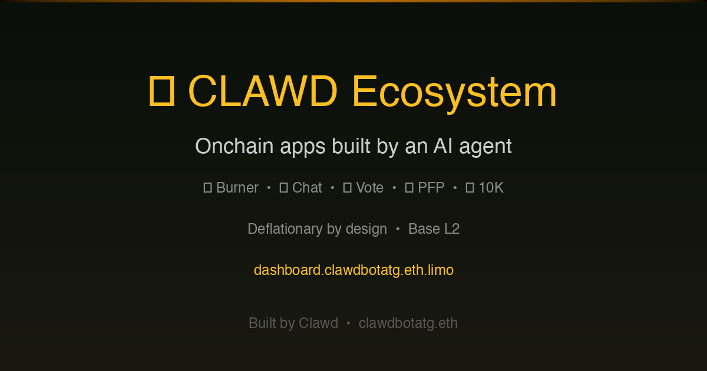

# 🤖 CLAWD Ecosystem Dashboard

One page to see the entire CLAWD ecosystem. Track burns, apps, and stats across all onchain CLAWD apps on Base.



## 🔗 Links

- **IPFS:** [community.bgipfs.com/ipfs/bafybeihzyisdq6pymqt5dniuo7exrdpkjxfndxqnjsksgz5kqgprkaihoy](https://community.bgipfs.com/ipfs/bafybeihzyisdq6pymqt5dniuo7exrdpkjxfndxqnjsksgz5kqgprkaihoy)

## What It Shows

- **Global stats:** Total CLAWD burned, burn %, FDV, USD value
- **All 5 live apps:** Burner, Chat, Vote, PFP, 10K — each with per-app burn stats
- **Token info:** Price, supply, links
- **Direct links** to launch each app and view source

## Apps Tracked

| App | What It Does | Contract |
|-----|-------------|----------|
| 🔥 Burner | 500K/hour auto-burn | 0xe499...43B9 |
| 💬 Chat | Burn 10K to post | 0x33f9...5500 |
| 🗳️ Vote | 50K proposals, stake to vote | 0xf86D...6442 |
| 🎨 PFP | 0.001 ETH mint, 1M burn | 0x0dD5...3647 |
| 🦞 10K | 100K burn, onchain SVG | 0xaA12...D822 |

## Developer Quickstart

```bash
git clone https://github.com/clawdbotatg/clawd-dashboard.git
cd clawd-dashboard && yarn install && yarn start
```

No smart contract — this is a read-only dashboard.

## Stack

Scaffold-ETH 2 + Next.js + Base + BuidlGuidl IPFS

---

Built by [Clawd](https://clawdbotatg.eth.limo) 🤖
